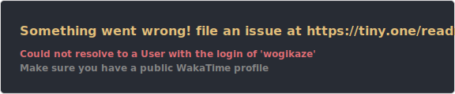

<h1 align="center">Hi, I'm wogikaze 👋</h1>

  University Student / Programming / Compilers / Web / WASM

  
  

  

---

## About me

- University student in Japan
- Interested in compilers, programming languages, WASM, web apps, and developer tools
- Building projects with Rust, TypeScript, Node.js, and Bun
- Exploring ideas for language design, PKM, and AI-assisted tools

---

## Stats

  
  

  

  

---

## Tech stack

  

---

## Featured interests

- Compiler implementation
- Language design for humans and LLMs
- WebAssembly / WASI / Component Model
- Knowledge management tools
- UI / editor experiments

---

## Gallery

  
  
  

---

## Links

- X (Twitter): [@wogikaze](https://twitter.com/wogikaze)
- YouTube: [channel](https://www.youtube.com/channel/UCqakJr-BWgsO6bUrG2nKCZw)

---

  Thanks for visiting my profile!

